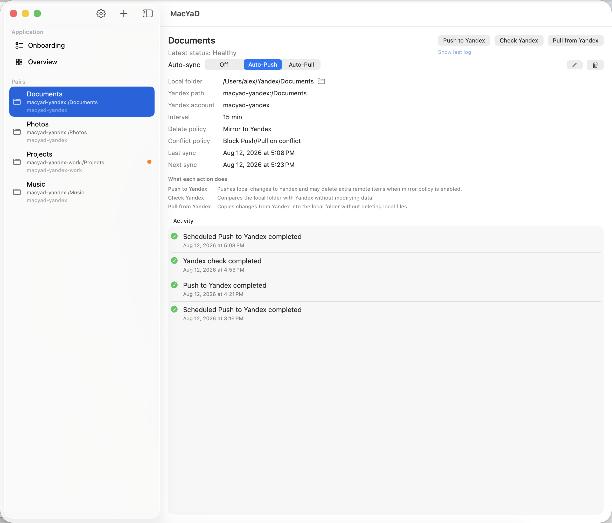
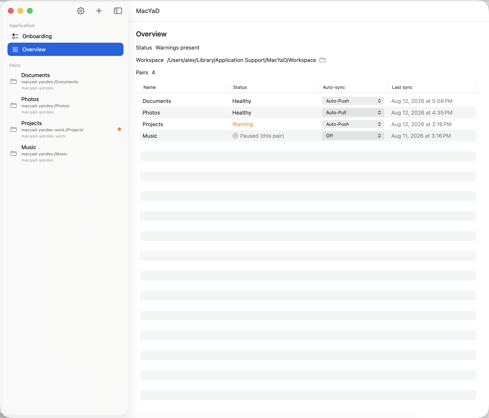
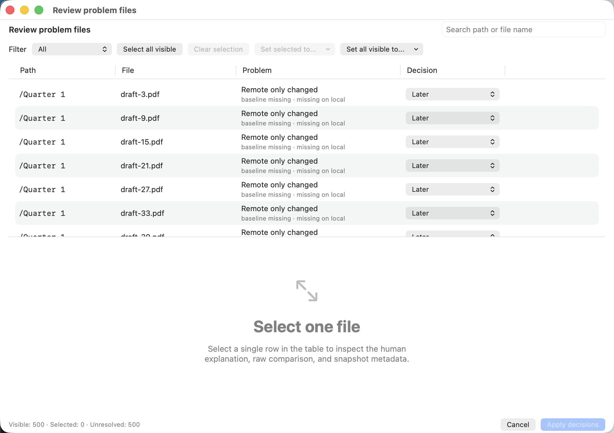
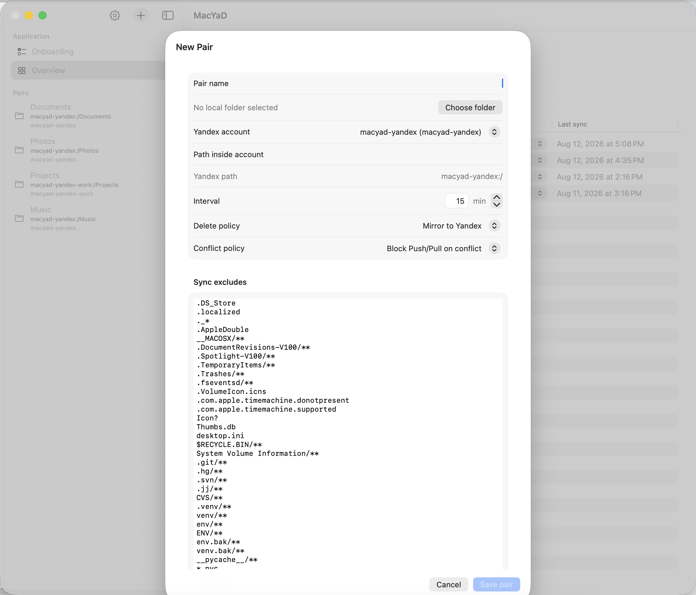
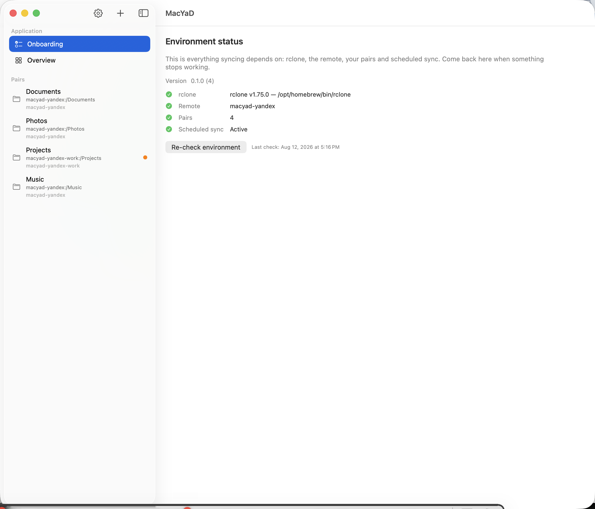

**English** | [Русский](#macyad-русский)

<div align="center">


# MacYaD

**A native macOS menu bar app for safe, one-way Yandex Disk sync — powered by rclone.**

[](https://github.com/orloffas/macyad/releases/latest)
[](https://github.com/orloffas/macyad/actions/workflows/ci.yml)




</div>

## What MacYaD is

Keeping a large folder on Yandex Disk from a Mac leaves you with two options, and neither is comfortable: the official client, on the terms described [below](#why-not-the-official-client), or `rclone` by hand — which does the job well, but is a command line tool where you write the flags yourself, and one wrong direction quietly overwrites a year of work.

MacYaD is a native front end for that job. It keeps a list of **sync pairs** — a local folder, a Yandex account, a remote path — and runs `rclone` for you with a safety check in front of every destructive step. It lives in the menu bar, shows what happened and why, and stops rather than guessing whenever the two sides disagree.

It does not implement its own sync engine, and it does not replace `rclone`. It decides *when it is safe to run it*.

## Why not the official client

Yandex ships a desktop client. These are the reasons this project exists instead — all of them from Yandex's own documents, not from anyone's opinion:

- **Desktop sync is a paid feature.** In Yandex Disk 4.0, connecting a folder and syncing it requires a Yandex 360 subscription; without one, files move only through the web version and the mobile app. ([support page](https://yandex.ru/support/yandex-360/customers/disk/4/windows/ru/synchronization/status))
- **The desktop licence covers more than files.** Yandex's [desktop software agreement](https://yandex.ru/legal/desktop_software_agreement/) — which names «Яндекс.Диск» in §1.1 — has the user agree to send Yandex their IP address and *data about the networks available to the computer, including wireless ones* (§5.11), plus OS type, program version and identifier, feature usage statistics and "other technical information", which Yandex "has the right to use in its other services and programs for any purpose" (§6.3).
- **It updates itself silently.** The same agreement has the user consent to automatic download and installation of updates "without any additional notifications" (§7.1).
- **On mobile it is an advertising surface too.** The App Store privacy labels for the Disk app declare tracking via contact info and identifiers, and a Device ID shared for third-party advertising.

MacYaD replaces the client, not the storage — your files still live on Yandex Disk, under Yandex's terms, and nothing here changes what the service itself sees. What changes is the software on your Mac: the only process that touches the network is `rclone`, talking to the Disk API with a token you created; there is no telemetry, no silent updater, and the code is open. It also works through that API rather than through the desktop program, which is a different door than the one gated above.

## Before you install

Worth knowing up front, so nothing here is a surprise:

- **`rclone` is required.** MacYaD does not bundle it. Install it with `brew install rclone` and configure a Yandex remote — the app shows you the exact commands to copy.
- **This is not two-way sync.** Each pair syncs in one direction, `Auto-Push` **or** `Auto-Pull`, never both. That is a deliberate design decision, not a missing feature — see [How syncing works](#how-syncing-works).
- **`Push to Yandex` uses `rclone sync`.** It makes the remote match the local folder, which includes deleting remote files that are gone locally. Safety checks run first, but you should understand the direction before enabling a schedule.
- **Builds are self-signed and not notarized.** There is no paid Apple Developer account behind this project, so macOS will warn you on first launch. [Installation](#installation) has the two-click way around it.
- **The app is not sandboxed.** It launches an external binary (`rclone`) and works with folders you pick anywhere on disk, neither of which a sandboxed app can do. macOS will ask for permission the first time it touches a folder.
- **Everything stays on your Mac.** No account of ours, no telemetry, no server. Your `rclone` credentials live in an `rclone.conf` under your own home directory.

## Features

- **Sync pairs** — a local folder bound to one Yandex account and one remote path, with its own schedule, exclude patterns and conflict policy.
- **Three explicit operations** — `Push to Yandex`, `Pull from Yandex` and `Check Yandex`, each available on demand. Only one runs at a time; the rest queue up.
- **Baseline-aware safety** — before any transfer, the current state is compared against the last agreed baseline, so a change made on the other side blocks the run instead of being silently overwritten.
- **Conflict review** — when a run is blocked you get the actual file list, with search and filters, and decide per file or in bulk: `Keep local`, `Keep remote`, `Keep both` or `Later`.
- **Non-destructive scheduling** — a scheduled run that finds drift stops and raises a warning. Automation never resolves a conflict on its own.
- **Live monitor** — the raw `rclone` output as it streams, plus the exact command and its exit status. The last log of a finished run is kept.
- **Activity journal** — 48 hours of events with severity, full `rclone` logs for anything that went wrong, and the reviewable file list attached to blocked runs.
- **Multiple accounts** — several Yandex accounts side by side, each with its own remote in the app-managed `rclone.conf`.
- **Config export & import** — move your pairs, accounts and preferences to another Mac. Credentials and folder permissions stay behind, and imported schedules arrive switched off.
- **English and Russian** — the entire interface, switchable in Settings.

## Screenshots

| | |
|:---:|:---:|
|  |  |
| **Overview** — every pair, its direction, state and last sync. | **Conflict review** — the blocked files, and what to do with each. |
|  |  |
| **New pair** — folder, account, remote path, schedule, excludes. | **Environment status** — rclone, remote, pairs, scheduling, checked on demand. |

## How syncing works

Three operations, and the app is deliberate about what each one does:

| Operation | Under the hood | Direction |
|---|---|---|
| `Push to Yandex` | `rclone sync` | local → Yandex, remote is made to match |
| `Pull from Yandex` | `rclone copy` | Yandex → local, nothing is deleted locally |
| `Check Yandex` | `rclone check --one-way` | compares both sides, changes nothing |

**The baseline.** After a successful run, MacYaD records what both sides looked like when they agreed. Every later run compares against that snapshot, which is what lets it tell *"you changed this file"* apart from *"the other side changed this file"* — a plain `rclone sync` cannot distinguish the two and simply overwrites.

**When they disagree.** The run stops. `Check Yandex` classifies the situation as clean, baseline missing, remote-only drift, local-only drift or a true conflict, and a blocked run keeps the offending files attached to its journal entry, where you resolve them by hand.

**Why there is no two-way mode.** `Push` and `Pull` operate on the whole tree. Running both directions automatically would need a per-file engine resolving conflicts on its own — exactly the mechanism that loses files quietly in other clients. Making the two directions mutually exclusive per pair keeps that state unrepresentable.

**Scheduling.** Each pair is `Off`, `Auto-Push` or `Auto-Pull`, with its own interval. A scheduled run executes only when the preflight considers it safe; otherwise the pair turns to `warning` with a reviewable file list, and nothing is transferred. Notifications are sent for warnings and alarms only, and only after you grant permission in Settings.

## Requirements

- macOS 14.0 or later (Apple Silicon or Intel)
- [`rclone`](https://rclone.org) — `brew install rclone`
- A Yandex Disk account
- To build: Xcode 16+ and [`xcodegen`](https://github.com/yonaskolb/XcodeGen) — `brew install xcodegen`

## Installation

[**Download the latest release**](https://github.com/orloffas/macyad/releases/latest) — a DMG with the app inside. Open it and drag MacYaD to Applications.

Or build it yourself:

```bash
git clone https://github.com/orloffas/macyad.git
cd macyad
./script/build_and_run.sh
```

The script generates the Xcode project, builds the app, installs it to `/Applications/MacYaD.app` — or `~/Applications` if the system folder is not writable — and launches it. Run without arguments it asks what you want; `--clean`, `--no-launch`, `--package-dmg` and `--background` do the same non-interactively.

**First launch.** Because the build is self-signed, macOS blocks the first open. Right-click `MacYaD.app` → **Open** → **Open** in the dialog. Once is enough.

**Folder permissions.** The first time a pair touches a folder, macOS asks for access. Pick your folders through the app's own folder picker and the grant is remembered.

**Rebuilding without re-granting permissions (optional).** By default Xcode signs each build ad-hoc, the code hash changes, and macOS treats every rebuild as a brand new app — so it asks for folder access again. A one-time self-signed certificate fixes that; see [`docs/local-signing.md`](docs/local-signing.md).

## First run

The **Onboarding** pane walks through the three steps and checks each one:

1. **Install `rclone`** — copy `brew install rclone`, run it, come back and press *Re-check environment*.
2. **Configure a Yandex remote** — copy the `rclone config create … yandex` command the app shows. It opens a browser for Yandex to authorize; the token lands in the config file the app manages.
3. **Create your first pair** — pick a local folder, the account, the remote path, an interval and a direction.

Once configured, the same pane becomes a permanent environment check: `rclone` version and path, the configured remote, the number of pairs, and whether scheduling is running. It is where to look first when sync stops working.

## Where your data lives

Everything sits under `~/Library/Application Support/MacYaD/`:

| Path | Contents |
|---|---|
| `rclone/rclone.conf` | app-managed `rclone` config, including remote tokens |
| `rclone/filters/` | generated `--exclude-from` files |
| `conflicts/` | baseline snapshots used by the conflict planner |
| `pairs.json`, `accounts.json` | your pairs and accounts |
| `preferences.json` | app settings |
| `activity.json` | the 48-hour journal |

**Export** (Settings → Configuration) writes pairs, accounts and preferences to a single JSON file. It deliberately leaves out `rclone` credentials, macOS folder permissions and run history — those are tied to one machine and one keychain. **Import** replaces the current configuration, disables every schedule and marks pairs whose folder or remote is missing on this Mac.

## Development

```bash
xcodegen generate                 # Macyad.xcodeproj is generated, not committed
./script/test.sh unit             # MacyadCore unit tests
./script/test.sh ui               # unit + XCUITest (needs an unlocked, awake display)
./script/build_and_run.sh --verify
```

The layout is a plain Domain / Infrastructure / ViewModels / Views split, with `MacyadCore` holding everything testable and the app target holding the SwiftUI layer and the AppKit bridges. Per-directory `AGENTS.md` files document each area, including the UI conventions in `Macyad/Views/AGENTS.md`.

The screenshots in this README are produced by `MacyadUITests/ScreenshotUITests.swift` against a seeded demonstration configuration — no real account or folder is ever shown.

## Troubleshooting

**`rclone` not found.** The app looks in the usual Homebrew locations. Check the Onboarding pane: it reports the exact path it resolved.

**A pair refuses to push or pull.** Open the pair's latest journal entry — a blocked run always says which side changed and lists the files. `Check Yandex` re-runs the comparison without touching anything.

**macOS asks for folder access after every rebuild.** Expected with ad-hoc signing; see the stable signing note in [Installation](#installation).

**Starting over.** Quit the app and remove its state:

```bash
pkill -x MacYaD || true
rm -rf "$HOME/Library/Application Support/MacYaD"
rm -rf "$HOME/Library/Saved Application State/me.orloff.macyad.savedState"
defaults delete me.orloff.macyad 2>/dev/null || true
```

This deletes your pairs, preferences and journal. Your synced files are untouched.

## Contributing

- **Found a bug?** [Open a bug report](https://github.com/orloffas/macyad/issues/new?template=bug_report.yml). The form asks for the rclone version, the macOS version and the journal entry — a sync report without those cannot be acted on. **Settings → About** has a button that copies all of them at once.
- **Question, or not sure it is a bug?** [Ask here](https://github.com/orloffas/macyad/issues/new?template=question.yml) — the form is short.
- **Security issue?** Not a public issue, please — [SECURITY.md](SECURITY.md) explains where it goes.
- **Sending code?** [CONTRIBUTING.md](CONTRIBUTING.md) covers the setup, the tests, and the handful of changes this project will not take. `main` is pull-request-only and CI has to pass, maintainer included.

## License

[MIT](LICENSE) © Andrei Orlov

Built on [`rclone`](https://rclone.org), which does the actual work. MacYaD is not affiliated with Yandex or with the rclone project.

---

# MacYaD (русский)

[English](#macyad) | **Русский**

<div align="center">


**Нативное macOS-приложение в menu bar для безопасной односторонней синхронизации с Яндекс Диском на движке rclone.**

[](https://github.com/orloffas/macyad/releases/latest)
[](https://github.com/orloffas/macyad/actions/workflows/ci.yml)


</div>

## Что такое MacYaD

Держать большую папку на Яндекс Диске с Mac можно двумя способами, и оба неудобны: официальный клиент — на условиях, описанных [ниже](#почему-не-официальный-клиент), — или `rclone` руками. Второй делает работу отлично, но это CLI: флаги пишешь сам, и одно неверное направление молча затирает годовой архив.

MacYaD — нативная оболочка для этой задачи. Он хранит список **sync-пар** (локальная папка + аккаунт Яндекса + remote-путь) и запускает `rclone` за вас, но перед каждым разрушительным шагом делает проверку безопасности. Живёт в menu bar, показывает, что произошло и почему, и **останавливается**, а не угадывает, когда две стороны разошлись.

Он не реализует собственный движок синхронизации и не заменяет `rclone`. Он решает, *когда запускать его безопасно*.

## Почему не официальный клиент

У Яндекса есть свой десктопный клиент. Вот причины, по которым существует этот проект, — все они из документов самого Яндекса, а не из чьих-то оценок:

- **Десктопная синхронизация — платная.** В программе Яндекс Диск 4.0 подключение папки и синхронизация доступны только на тарифах Яндекс 360; без тарифа файлы можно загружать и скачивать лишь в веб-версии и мобильном приложении. ([справка](https://yandex.ru/support/yandex-360/customers/disk/4/windows/ru/synchronization/status))
- **Лицензия покрывает не только файлы.** [Лицензионное соглашение на настольное ПО](https://yandex.ru/legal/desktop_software_agreement/), действующее в том числе для «Яндекс.Диска» (п. 1.1), содержит согласие пользователя на передачу Яндексу IP-адреса и *данных о доступных компьютеру сетях, включая беспроводные* (п. 5.11), а также типа ОС, версии и идентификатора программы, статистики использования функций и «иной технической информации», которую правообладатель «вправе использовать в иных своих сервисах и программах в любых целях» (п. 6.3).
- **Обновляется молча.** Там же — согласие на автоматическую загрузку и установку обновлений «без каких-либо дополнительных уведомлений» (п. 7.1).
- **На мобильных это ещё и рекламная площадка.** В privacy labels App Store у приложения Диска заявлены трекинг через контактные данные и идентификаторы, а также Device ID, передаваемый для рекламы третьих лиц.

MacYaD заменяет клиент, а не хранилище: файлы по-прежнему лежат на Яндекс Диске и на условиях Яндекса, и на то, что видит сам сервис, это ничего не меняет. Меняется софт на вашем Mac: единственный процесс, который ходит в сеть, — `rclone`, обращающийся к API Диска с токеном, который вы создали сами. Ни телеметрии, ни тихого автообновления, исходный код открыт. И работает он через API, а не через десктопную программу, — это другая дверь, не та, что закрыта тарифом выше.

## Что важно знать до установки

Чтобы ничего не оказалось неожиданностью:

- **Нужен `rclone`.** MacYaD его не поставляет. Ставится через `brew install rclone`, дальше настраивается Яндекс-remote — приложение показывает готовые команды для копирования.
- **Это не двусторонняя синхронизация.** Каждая пара работает в одну сторону: `Auto-Push` **или** `Auto-Pull`, но не оба сразу. Это осознанное решение, а не недоделка — см. [Как работает синхронизация](#как-работает-синхронизация).
- **`Push to Yandex` — это `rclone sync`.** Он приводит remote в соответствие с локальной папкой, включая удаление на Яндексе того, что удалено локально. Проверки безопасности выполняются заранее, но направление нужно понимать до включения расписания.
- **Сборки подписаны self-signed сертификатом и не нотаризованы.** Платного Apple Developer account у проекта нет, поэтому при первом запуске macOS покажет предупреждение. Как его пройти в два клика — в разделе [Установка](#установка).
- **Приложение работает без sandbox.** Оно запускает внешний бинарник (`rclone`) и работает с папками в любом месте диска — ни то, ни другое sandbox не позволяет. При первом обращении к папке macOS спросит разрешение.
- **Всё остаётся на вашем Mac.** Никаких наших аккаунтов, телеметрии и серверов. Учётные данные `rclone` лежат в `rclone.conf` в вашей домашней директории.

## Возможности

- **Sync-пары** — локальная папка, привязанная к одному аккаунту Яндекса и одному remote-пути, со своим расписанием, exclude-паттернами и conflict policy.
- **Три явные операции** — `Push to Yandex`, `Pull from Yandex` и `Check Yandex`, каждая доступна вручную; одновременно выполняется только одна, остальные встают в очередь.
- **Baseline-aware защита** — перед любой передачей текущее состояние сравнивается с последним согласованным baseline, поэтому изменение на другой стороне блокирует запуск, а не затирается молча.
- **Разбор конфликтов** — если запуск заблокирован, вы получаете реальный список файлов с поиском и фильтрами и решаете по каждому файлу или пакетно: «Оставить local», «Оставить remote», «Сохранить обе» или «Позже».
- **Неразрушающее расписание** — плановый запуск, обнаруживший расхождение, останавливается и поднимает предупреждение. Автоматика никогда не решает конфликт сама.
- **Live monitor** — вывод `rclone` в реальном времени, точная команда и её exit status. Лог последнего завершённого запуска сохраняется.
- **Журнал Activity** — 48 часов событий с severity, полными логами `rclone` для всего, что пошло не так, и списком проблемных файлов у заблокированных запусков.
- **Несколько аккаунтов** — сколько угодно аккаунтов Яндекса одновременно, у каждого свой remote в управляемом приложением `rclone.conf`.
- **Экспорт и импорт конфигурации** — перенос пар, аккаунтов и настроек на другой Mac. Учётные данные и разрешения на папки не переносятся, импортированные расписания приходят выключенными.
- **Английский и русский** — весь интерфейс, переключается в Settings.

## Скриншоты

| | |
|:---:|:---:|
|  |  |
| **Обзор** — все пары, направление, состояние и время последней синхронизации. | **Разбор конфликтов** — заблокированные файлы и решение по каждому. |
|  |  |
| **Новая пара** — папка, аккаунт, remote-путь, расписание, excludes. | **Состояние окружения** — rclone, remote, пары, планировщик; проверка по кнопке. |

## Как работает синхронизация

Три операции, и приложение чётко разделяет, что делает каждая:

| Операция | Под капотом | Направление |
|---|---|---|
| `Push to Yandex` | `rclone sync` | локально → Яндекс, remote приводится в соответствие |
| `Pull from Yandex` | `rclone copy` | Яндекс → локально, локально ничего не удаляется |
| `Check Yandex` | `rclone check --one-way` | сравнивает обе стороны, ничего не меняет |

**Baseline.** После успешного запуска MacYaD запоминает, как выглядели обе стороны в момент согласия. Каждый следующий запуск сравнивается с этим снимком — именно это позволяет отличить *«этот файл изменили вы»* от *«этот файл изменили на другой стороне»*. Обычный `rclone sync` этой разницы не видит и просто затирает.

**Когда стороны разошлись.** Запуск останавливается. `Check Yandex` классифицирует ситуацию как clean, отсутствующий baseline, изменения только на remote, изменения только локально или настоящий конфликт. У заблокированного запуска список проблемных файлов остаётся прикреплённым к записи журнала, где вы разбираете его вручную.

**Почему нет двустороннего режима.** `Push` и `Pull` работают с деревом целиком. Автоматическая работа в обе стороны потребовала бы per-file движка, решающего конфликты самостоятельно, — ровно того механизма, который в других клиентах тихо теряет файлы. Взаимоисключающие направления на уровне пары делают это состояние непредставимым.

**Расписание.** Каждая пара — `Выключена`, `Auto-Push` или `Auto-Pull`, со своим интервалом. Плановый запуск выполняется, только если preflight считает его безопасным; иначе пара уходит в `warning` со списком файлов для разбора, и ничего не передаётся. Уведомления отправляются только для warning и alarm и только после того, как вы выдали разрешение в Settings.

## Требования

- macOS 14.0 или новее (Apple Silicon или Intel)
- [`rclone`](https://rclone.org) — `brew install rclone`
- Аккаунт Яндекс Диска
- Для сборки: Xcode 16+ и [`xcodegen`](https://github.com/yonaskolb/XcodeGen) — `brew install xcodegen`

## Установка

[**Скачать последний релиз**](https://github.com/orloffas/macyad/releases/latest) — DMG с приложением внутри. Откройте его и перетащите MacYaD в Applications.

Либо соберите сами:

```bash
git clone https://github.com/orloffas/macyad.git
cd macyad
./script/build_and_run.sh
```

Скрипт генерирует Xcode-проект, собирает приложение, устанавливает его в `/Applications/MacYaD.app` — или в `~/Applications`, если системная папка недоступна на запись, — и запускает. Без аргументов он спрашивает, что делать; `--clean`, `--no-launch`, `--package-dmg` и `--background` делают то же самое неинтерактивно.

**Первый запуск.** Сборка self-signed, поэтому macOS блокирует первое открытие. Правый клик по `MacYaD.app` → **Открыть** → **Открыть** в диалоге. Достаточно одного раза.

**Доступ к папкам.** При первом обращении пары к папке macOS запросит разрешение. Выбирайте папки через встроенный picker приложения — тогда выданный доступ запоминается.

**Пересборка без повторной выдачи разрешений (опционально).** По умолчанию Xcode подписывает каждую сборку ad-hoc, хеш кода меняется, и macOS считает каждую пересборку новым приложением — отсюда повторные запросы доступа к папкам. Лечится одноразовым self-signed сертификатом: [`docs/local-signing.ru.md`](docs/local-signing.ru.md).

## Первый запуск

Раздел **Подключение** проводит по трём шагам и проверяет каждый:

1. **Установить `rclone`** — скопируйте `brew install rclone`, выполните, вернитесь и нажмите *Проверить окружение*.
2. **Настроить Яндекс-remote** — скопируйте команду `rclone config create … yandex`, которую показывает приложение. Она откроет браузер для авторизации в Яндексе; токен попадёт в конфиг, которым управляет приложение.
3. **Создать первую пару** — выберите локальную папку, аккаунт, remote-путь, интервал и направление.

После настройки этот же раздел становится постоянной панелью диагностики: версия и путь `rclone`, настроенный remote, число пар и состояние планировщика. Сюда смотрят в первую очередь, когда синхронизация перестала работать.

## Где лежат данные

Всё находится в `~/Library/Application Support/MacYaD/`:

| Путь | Содержимое |
|---|---|
| `rclone/rclone.conf` | управляемый приложением конфиг `rclone`, включая токены remote |
| `rclone/filters/` | сгенерированные файлы `--exclude-from` |
| `conflicts/` | baseline-снимки для планировщика конфликтов |
| `pairs.json`, `accounts.json` | ваши пары и аккаунты |
| `preferences.json` | настройки приложения |
| `activity.json` | журнал за 48 часов |

**Экспорт** (Settings → Configuration) записывает пары, аккаунты и настройки в один JSON-файл. Он намеренно не включает учётные данные `rclone`, разрешения macOS на папки и историю запусков — всё это привязано к конкретной машине и её keychain. **Импорт** заменяет текущую конфигурацию, выключает все расписания и помечает пары, у которых на этом Mac нет папки или remote.

## Разработка

```bash
xcodegen generate                 # Macyad.xcodeproj генерируется, в репозитории его нет
./script/test.sh unit             # unit-тесты MacyadCore
./script/test.sh ui               # unit + XCUITest (нужен разблокированный, не спящий экран)
./script/build_and_run.sh --verify
```

Структура — обычное разделение Domain / Infrastructure / ViewModels / Views: в `MacyadCore` лежит всё тестируемое, в app-таргете — слой SwiftUI и мосты к AppKit. Каждую область описывает свой `AGENTS.md`; UI-конвенции — в `Macyad/Views/AGENTS.md`.

Скриншоты в этом README снимает `MacyadUITests/ScreenshotUITests.swift` на seeded демонстрационной конфигурации — реальные аккаунты и папки в кадр не попадают.

## Если что-то пошло не так

**`rclone` не найден.** Приложение ищет его в стандартных путях Homebrew. Смотрите раздел «Подключение»: там показан конкретный путь, который удалось определить.

**Пара отказывается делать push или pull.** Откройте последнюю запись журнала этой пары — у заблокированного запуска всегда написано, какая сторона изменилась, и приложен список файлов. `Check Yandex` перезапускает сравнение, ничего не трогая.

**macOS спрашивает доступ к папкам после каждой пересборки.** Ожидаемо при ad-hoc подписи, лечится стабильным сертификатом — см. [Установка](#установка).

**Начать с нуля.** Закройте приложение и удалите его состояние:

```bash
pkill -x MacYaD || true
rm -rf "$HOME/Library/Application Support/MacYaD"
rm -rf "$HOME/Library/Saved Application State/me.orloff.macyad.savedState"
defaults delete me.orloff.macyad 2>/dev/null || true
```

Это удалит пары, настройки и журнал. Синхронизированные файлы не затрагиваются.

## Участие в проекте

- **Нашли баг?** [Заведите bug report](https://github.com/orloffas/macyad/issues/new?template=bug_report.yml). Форма просит версию rclone, версию macOS и запись журнала — без них сообщение о проблеме синхронизации разобрать невозможно. В **Settings → О программе** есть кнопка, которая копирует всё это разом.
- **Вопрос или не уверены, что это баг?** [Спросите здесь](https://github.com/orloffas/macyad/issues/new?template=question.yml) — форма короткая, писать можно по-русски.
- **Проблема с безопасностью?** Пожалуйста, не в публичный issue — куда именно, написано в [SECURITY.ru.md](SECURITY.ru.md).
- **Присылаете код?** В [CONTRIBUTING.ru.md](CONTRIBUTING.ru.md) — сборка, тесты и короткий список того, что в этот проект не примут. Ветка `main` принимает только pull request'ы, и CI обязан быть зелёным, включая мейнтейнера.

## Лицензия

[MIT](LICENSE) © Andrei Orlov

Работает на [`rclone`](https://rclone.org), который и делает всю настоящую работу. MacYaD не аффилирован ни с Яндексом, ни с проектом rclone.
