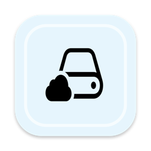
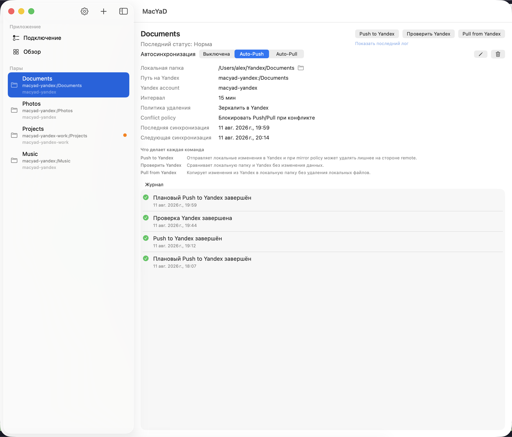
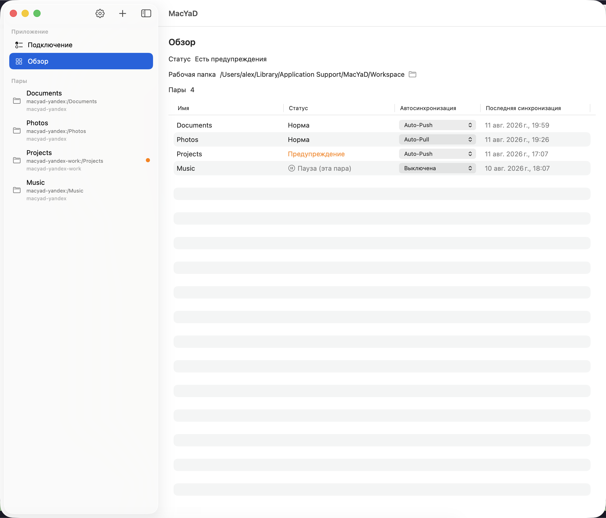
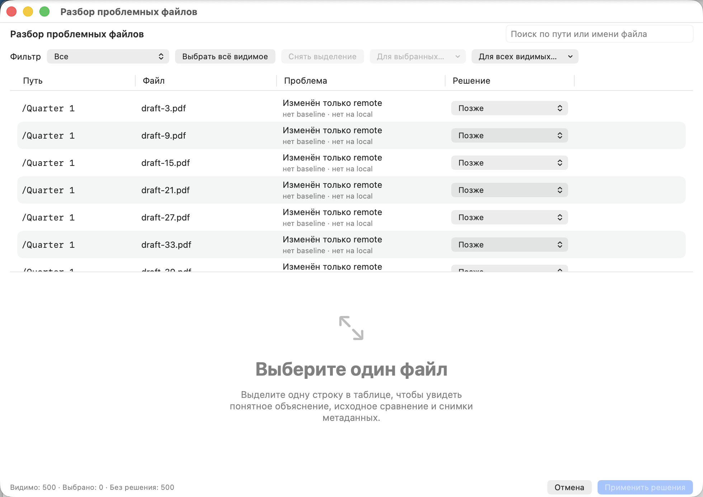
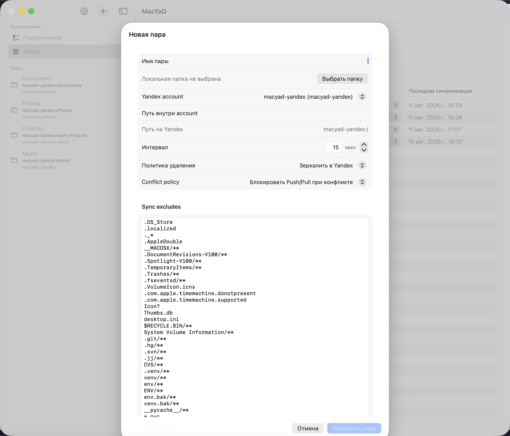
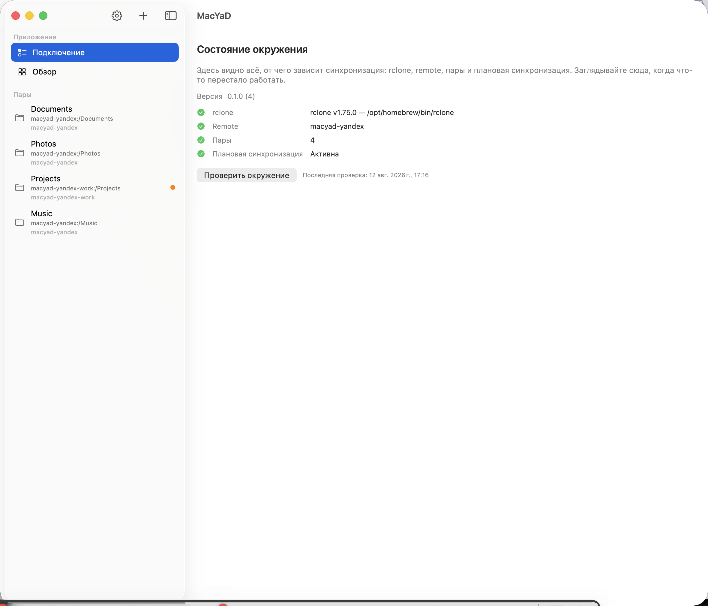

[English](README.md) | **Русский**

<div align="center">



# MacYaD

**Нативное macOS-приложение в menu bar для безопасной односторонней синхронизации с Яндекс Диском на движке rclone.**

[](https://github.com/orloffas/macyad/actions/workflows/ci.yml)




</div>

## Что такое MacYaD

Держать большую папку на Яндекс Диске с Mac можно двумя способами, и оба неудобны: официальный клиент — на условиях, описанных [ниже](#почему-не-официальный-клиент), — или `rclone` руками. Второй делает работу отлично, но это CLI: флаги пишешь сам, и одно неверное направление молча затирает годовой архив.

MacYaD — нативная оболочка для этой задачи. Он хранит список **sync-пар** (локальная папка + аккаунт Яндекса + remote-путь) и запускает `rclone` за вас, но перед каждым разрушительным шагом делает проверку безопасности. Живёт в menu bar, показывает, что произошло и почему, и **останавливается**, а не угадывает, когда две стороны разошлись.

Он не реализует собственный движок синхронизации и не заменяет `rclone`. Он решает, *когда запускать его безопасно*.

## Почему не официальный клиент

У Яндекса есть свой десктопный клиент. Вот причины, по которым существует этот проект, — все они из документов самого Яндекса, а не из чьих-то оценок:

- **Десктопная синхронизация — платная.** В программе Яндекс Диск 4.0 подключение папки и синхронизация доступны только на тарифах Яндекс 360; без тарифа файлы можно загружать и скачивать лишь в веб-версии и мобильном приложении. ([справка](https://yandex.ru/support/yandex-360/customers/disk/4/windows/ru/synchronization/status))
- **Лицензия покрывает не только файлы.** [Лицензионное соглашение на настольное ПО](https://yandex.ru/legal/desktop_software_agreement/), действующее в том числе для «Яндекс.Диска» (п. 1.1), содержит согласие пользователя на передачу Яндексу IP-адреса и *данных о доступных компьютеру сетях, включая беспроводные* (п. 5.11), а также типа ОС, версии и идентификатора программы, статистики использования функций и «иной технической информации», которую правообладатель «вправе использовать в иных своих сервисах и программах в любых целях» (п. 6.3).
- **Обновляется молча.** Там же — согласие на автоматическую загрузку и установку обновлений «без каких-либо дополнительных уведомлений» (п. 7.1).
- **На мобильных это ещё и рекламная площадка.** В privacy labels App Store у приложения Диска заявлены трекинг через контактные данные и идентификаторы, а также Device ID, передаваемый для рекламы третьих лиц.

MacYaD заменяет клиент, а не хранилище: файлы по-прежнему лежат на Яндекс Диске и на условиях Яндекса, и на то, что видит сам сервис, это ничего не меняет. Меняется софт на вашем Mac: единственный процесс, который ходит в сеть, — `rclone`, обращающийся к API Диска с токеном, который вы создали сами. Ни телеметрии, ни тихого автообновления, исходный код открыт. И работает он через API, а не через десктопную программу, — это другая дверь, не та, что закрыта тарифом выше.

## Что важно знать до установки

Чтобы ничего не оказалось неожиданностью:

- **Нужен `rclone`.** MacYaD его не поставляет. Ставится через `brew install rclone`, дальше настраивается Яндекс-remote — приложение показывает готовые команды для копирования.
- **Это не двусторонняя синхронизация.** Каждая пара работает в одну сторону: `Auto-Push` **или** `Auto-Pull`, но не оба сразу. Это осознанное решение, а не недоделка — см. [Как работает синхронизация](#как-работает-синхронизация).
- **`Push to Yandex` — это `rclone sync`.** Он приводит remote в соответствие с локальной папкой, включая удаление на Яндексе того, что удалено локально. Проверки безопасности выполняются заранее, но направление нужно понимать до включения расписания.
- **Сборки подписаны self-signed сертификатом и не нотаризованы.** Платного Apple Developer account у проекта нет, поэтому при первом запуске macOS покажет предупреждение. Как его пройти в два клика — в разделе [Установка](#установка).
- **Приложение работает без sandbox.** Оно запускает внешний бинарник (`rclone`) и работает с папками в любом месте диска — ни то, ни другое sandbox не позволяет. При первом обращении к папке macOS спросит разрешение.
- **Всё остаётся на вашем Mac.** Никаких наших аккаунтов, телеметрии и серверов. Учётные данные `rclone` лежат в `rclone.conf` в вашей домашней директории.

## Возможности

- **Sync-пары** — локальная папка, привязанная к одному аккаунту Яндекса и одному remote-пути, со своим расписанием, exclude-паттернами и conflict policy.
- **Три явные операции** — `Push to Yandex`, `Pull from Yandex` и `Check Yandex`, каждая доступна вручную; одновременно выполняется только одна, остальные встают в очередь.
- **Baseline-aware защита** — перед любой передачей текущее состояние сравнивается с последним согласованным baseline, поэтому изменение на другой стороне блокирует запуск, а не затирается молча.
- **Разбор конфликтов** — если запуск заблокирован, вы получаете реальный список файлов с поиском и фильтрами и решаете по каждому файлу или пакетно: «Оставить local», «Оставить remote», «Сохранить обе» или «Позже».
- **Неразрушающее расписание** — плановый запуск, обнаруживший расхождение, останавливается и поднимает предупреждение. Автоматика никогда не решает конфликт сама.
- **Live monitor** — вывод `rclone` в реальном времени, точная команда и её exit status. Лог последнего завершённого запуска сохраняется.
- **Журнал Activity** — 48 часов событий с severity, полными логами `rclone` для всего, что пошло не так, и списком проблемных файлов у заблокированных запусков.
- **Несколько аккаунтов** — сколько угодно аккаунтов Яндекса одновременно, у каждого свой remote в управляемом приложением `rclone.conf`.
- **Экспорт и импорт конфигурации** — перенос пар, аккаунтов и настроек на другой Mac. Учётные данные и разрешения на папки не переносятся, импортированные расписания приходят выключенными.
- **Английский и русский** — весь интерфейс, переключается в Settings.

## Скриншоты

| | |
|:---:|:---:|
|  |  |
| **Обзор** — все пары, направление, состояние и время последней синхронизации. | **Разбор конфликтов** — заблокированные файлы и решение по каждому. |
|  |  |
| **Новая пара** — папка, аккаунт, remote-путь, расписание, excludes. | **Состояние окружения** — rclone, remote, пары, планировщик; проверка по кнопке. |

## Как работает синхронизация

Три операции, и приложение чётко разделяет, что делает каждая:

| Операция | Под капотом | Направление |
|---|---|---|
| `Push to Yandex` | `rclone sync` | локально → Яндекс, remote приводится в соответствие |
| `Pull from Yandex` | `rclone copy` | Яндекс → локально, локально ничего не удаляется |
| `Check Yandex` | `rclone check --one-way` | сравнивает обе стороны, ничего не меняет |

**Baseline.** После успешного запуска MacYaD запоминает, как выглядели обе стороны в момент согласия. Каждый следующий запуск сравнивается с этим снимком — именно это позволяет отличить *«этот файл изменили вы»* от *«этот файл изменили на другой стороне»*. Обычный `rclone sync` этой разницы не видит и просто затирает.

**Когда стороны разошлись.** Запуск останавливается. `Check Yandex` классифицирует ситуацию как clean, отсутствующий baseline, изменения только на remote, изменения только локально или настоящий конфликт. У заблокированного запуска список проблемных файлов остаётся прикреплённым к записи журнала, где вы разбираете его вручную.

**Почему нет двустороннего режима.** `Push` и `Pull` работают с деревом целиком. Автоматическая работа в обе стороны потребовала бы per-file движка, решающего конфликты самостоятельно, — ровно того механизма, который в других клиентах тихо теряет файлы. Взаимоисключающие направления на уровне пары делают это состояние непредставимым.

**Расписание.** Каждая пара — `Выключена`, `Auto-Push` или `Auto-Pull`, со своим интервалом. Плановый запуск выполняется, только если preflight считает его безопасным; иначе пара уходит в `warning` со списком файлов для разбора, и ничего не передаётся. Уведомления отправляются только для warning и alarm и только после того, как вы выдали разрешение в Settings.

## Требования

- macOS 14.0 или новее (Apple Silicon или Intel)
- [`rclone`](https://rclone.org) — `brew install rclone`
- Аккаунт Яндекс Диска
- Для сборки: Xcode 16+ и [`xcodegen`](https://github.com/yonaskolb/XcodeGen) — `brew install xcodegen`

## Установка

Готовых релизов пока нет, поэтому собираем из исходников:

```bash
git clone https://github.com/orloffas/macyad.git
cd macyad
./script/build_and_run.sh
```

Скрипт генерирует Xcode-проект, собирает приложение, устанавливает его в `~/Applications/MacYaD.app` и запускает. Без аргументов он спрашивает, что делать; `--clean`, `--no-launch`, `--package-dmg` и `--background` делают то же самое неинтерактивно.

**Первый запуск.** Сборка self-signed, поэтому macOS блокирует первое открытие. Правый клик по `MacYaD.app` → **Открыть** → **Открыть** в диалоге. Достаточно одного раза.

**Доступ к папкам.** При первом обращении пары к папке macOS запросит разрешение. Выбирайте папки через встроенный picker приложения — тогда выданный доступ запоминается.

**Пересборка без повторной выдачи разрешений (опционально).** По умолчанию Xcode подписывает каждую сборку ad-hoc, хеш кода меняется, и macOS считает каждую пересборку новым приложением — отсюда повторные запросы доступа к папкам. Лечится одноразовым self-signed сертификатом: [`docs/local-signing.ru.md`](docs/local-signing.ru.md).

## Первый запуск

Раздел **Подключение** проводит по трём шагам и проверяет каждый:

1. **Установить `rclone`** — скопируйте `brew install rclone`, выполните, вернитесь и нажмите *Проверить окружение*.
2. **Настроить Яндекс-remote** — скопируйте команду `rclone config create … yandex`, которую показывает приложение. Она откроет браузер для авторизации в Яндексе; токен попадёт в конфиг, которым управляет приложение.
3. **Создать первую пару** — выберите локальную папку, аккаунт, remote-путь, интервал и направление.

После настройки этот же раздел становится постоянной панелью диагностики: версия и путь `rclone`, настроенный remote, число пар и состояние планировщика. Сюда смотрят в первую очередь, когда синхронизация перестала работать.

## Где лежат данные

Всё находится в `~/Library/Application Support/MacYaD/`:

| Путь | Содержимое |
|---|---|
| `rclone/rclone.conf` | управляемый приложением конфиг `rclone`, включая токены remote |
| `rclone/filters/` | сгенерированные файлы `--exclude-from` |
| `conflicts/` | baseline-снимки для планировщика конфликтов |
| `pairs.json`, `accounts.json` | ваши пары и аккаунты |
| `preferences.json` | настройки приложения |
| `activity.json` | журнал за 48 часов |

**Экспорт** (Settings → Configuration) записывает пары, аккаунты и настройки в один JSON-файл. Он намеренно не включает учётные данные `rclone`, разрешения macOS на папки и историю запусков — всё это привязано к конкретной машине и её keychain. **Импорт** заменяет текущую конфигурацию, выключает все расписания и помечает пары, у которых на этом Mac нет папки или remote.

## Разработка

```bash
xcodegen generate                 # Macyad.xcodeproj генерируется, в репозитории его нет
./script/test.sh unit             # unit-тесты MacyadCore
./script/test.sh ui               # unit + XCUITest (нужен разблокированный, не спящий экран)
./script/build_and_run.sh --verify
```

Структура — обычное разделение Domain / Infrastructure / ViewModels / Views: в `MacyadCore` лежит всё тестируемое, в app-таргете — слой SwiftUI и мосты к AppKit. Каждую область описывает свой `AGENTS.md`, UI-конвенции — в [`DESIGN_PRINCIPLES.md`](DESIGN_PRINCIPLES.md).

Скриншоты в этом README снимает `MacyadUITests/ScreenshotUITests.swift` на seeded демонстрационной конфигурации — реальные аккаунты и папки в кадр не попадают.

## Если что-то пошло не так

**`rclone` не найден.** Приложение ищет его в стандартных путях Homebrew. Смотрите раздел «Подключение»: там показан конкретный путь, который удалось определить.

**Пара отказывается делать push или pull.** Откройте последнюю запись журнала этой пары — у заблокированного запуска всегда написано, какая сторона изменилась, и приложен список файлов. `Check Yandex` перезапускает сравнение, ничего не трогая.

**macOS спрашивает доступ к папкам после каждой пересборки.** Ожидаемо при ad-hoc подписи, лечится стабильным сертификатом — см. [Установка](#установка).

**Начать с нуля.** Закройте приложение и удалите его состояние:

```bash
pkill -x MacYaD || true
rm -rf "$HOME/Library/Application Support/MacYaD"
rm -rf "$HOME/Library/Saved Application State/me.orloff.macyad.savedState"
defaults delete me.orloff.macyad 2>/dev/null || true
```

Это удалит пары, настройки и журнал. Синхронизированные файлы не затрагиваются.

## Участие в проекте

- **Нашли баг?** [Заведите bug report](https://github.com/orloffas/macyad/issues/new?template=bug_report.yml). Форма просит версию rclone, версию macOS и запись журнала — без них сообщение о проблеме синхронизации разобрать невозможно.
- **Вопрос или не уверены, что это баг?** [Discussions](https://github.com/orloffas/macyad/discussions).
- **Проблема с безопасностью?** Пожалуйста, не в публичный issue — куда именно, написано в [SECURITY.md](SECURITY.md).
- **Присылаете код?** В [CONTRIBUTING.md](CONTRIBUTING.md) — сборка, тесты и короткий список того, что в этот проект не примут. Ветка `main` принимает только pull request'ы, и CI обязан быть зелёным, включая мейнтейнера.

## Лицензия

[MIT](LICENSE) © Andrei Orlov

Работает на [`rclone`](https://rclone.org), который и делает всю настоящую работу. MacYaD не аффилирован ни с Яндексом, ни с проектом rclone.
